# Forecast - Customer Churn 🔥

Customer churn is a measure of the number of accounts that stop buying, either by canceling a contract or not renewing it. In some cases, simply stopping placing orders, which immediately represents a loss of revenue. In this sense, it is a fundamental metric for obtaining strategic answers about the business, especially when it comes to thinking and acting with a view to the medium and long term.

In this way, predicting this customer turnover is extremely important for any business, as most companies with high revenue are those with high retention rates. Sean Ellis and Morgan Brown indicate in their book, Hacking Growth, that with just a 5% retention rate, a company can increase from 25% to 95% of its profit.

Data for analysis were made available within the data competitions platform [Kaggle](https://www.kaggle.com/datasets/mervetorkan/churndataset).

# 1.0 Business Problem
TopBank is a banking services company that operates mainly in European countries offering financial products, from bank accounts to investments, including some types of insurance and investment products. The company's main product is a bank account, in which the customer can deposit his salary, make withdrawals, deposits and transfers to other accounts. This bank account has a term of 12 months, that is, the customer needs to renew the account contract to continue using it for the next 12 months.

The CFO of the banking company has the need to study and understand the possible causes of the significant customer churn rate. To do so, he needs someone to develop a classification model that allows him to analyze predictions about the specified rate. In this sense, it would become possible for the marketing team to implement strategies in order to maximize the customers' ROI (Return on investment). 

In this way, the idea of this project is to assist the CFO in decision making, providing forecast results for each bank customer in probability, enabling the CFO to consult the probabilities of each customer via API.

# 2.0 Business Assumptions

For the construction of the solution, the following assumptions were considered:

- TopBank Revenue: According to TopBank's analysis team, each client with a bank account returns a monetary value of 3% of the estimated salary value if the salary is less than the average and 5% if that salary is more than the average, during the period current account agreement. This value is calculated annually.

- Approach to fighting churn: One measure to fight churn is to give customers a financial incentive to consider renewing their contracts. In our case, discount coupons were selected to be TopBank's financial incentive against the churning problem.

- Financial incentive budget: The company allows the marketing team to spend the amount it deems necessary, as long as ROI (Return Over Investment) is maximized.

- Destination of coupons: According to the marketing team, a discount coupon worth R$250.00 was selected for all customers with a churn probability greater than 80%, in order to try as much as possible to avoid possible churn.

## 2.1 Data Description

| Column            | Description                                                                                                                             |
| :---------------- | :-------------------------------------------------------------------------------------------------------------------------------------- |
| `RowNumber`       | Total number of columns in the dataset |
| `CustomerId` | Customer Unique Identifier |
| `Surname` | Customer Last Name |
| `CreditScore` | Customer Card Score |
| `Geography` | Location (Country) of the customer                                                                                                     |
| `Gender`          | Customer Gender |
| `Age` | Customer age |
| `Tenure` | Number of years that the customer contracts services with the bank |
| `Balande` | Customer's current balance on their bank account |
| `NumOfProducts` | Number of products the customer has purchased |
| `HasCrCard` | Whether the customer has (1) a credit card or not (0)
| `IsActiveMember` | Whether the customer is active (Last 12 months) |
| `EstimatedSalary` | Client's Estimated Annual Salary |
| `Exited` | Whether the customer churns (1) or not (0)

# 3.0 Solution Strategy

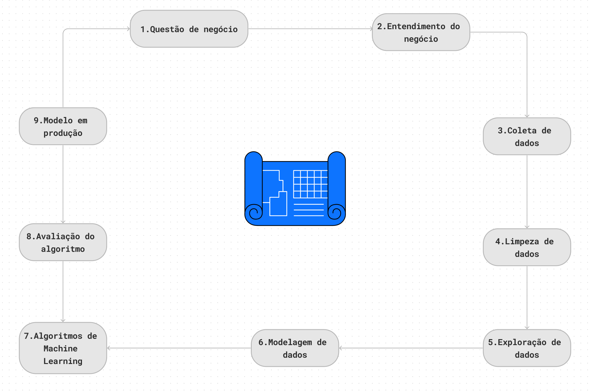

The strategy uses the CRISP-DS method, which consists of 9 cyclical steps, where at each iteration of the nine steps, the business result is being improved, aiming for increasingly faster deliveries and increasingly more quality and accuracy, thus enabling the teams that will use the developed results have a product that is minimally usable in the first delivery and that is perfected over time.

# 4.0 Insights

## 4.1 Mind Map 

## 4.2 Top 3 Insights

**Hypothesis 01: Does the age of the customer influence possible churn?**

**TRUE. Age has a significant influence, given that older people tend to churn ( From 48/49 years old )**

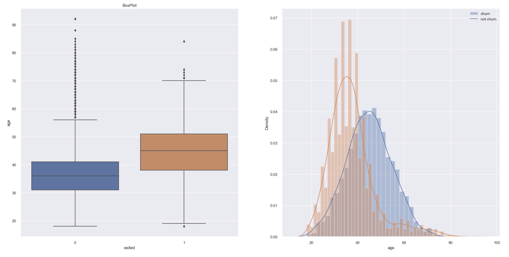

**Hypothesis 02: Does the customer's score influence possible churn?**

**FALSE. There is no significant difference in the churn of customers with high or low card scores**

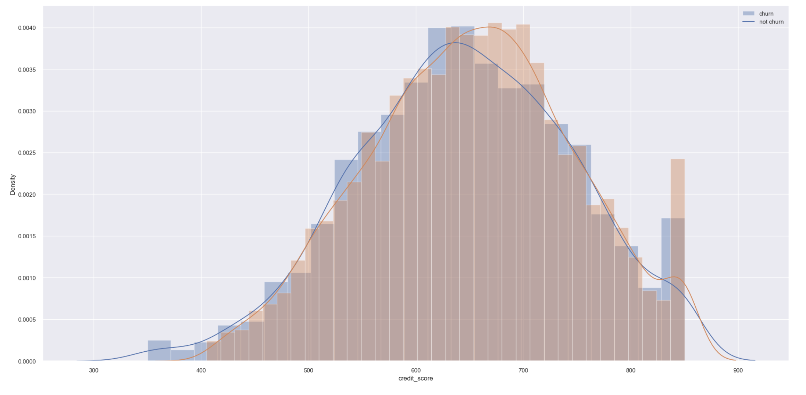

**Hypothesis 03: Does the number of products purchased by the customer influence possible churn?**

**TRUE. The number of products influences a possible churn, given that people with fewer products tend to churn ( churn rate above average )**

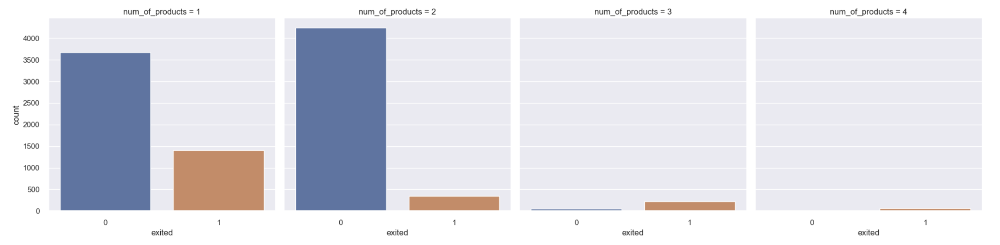

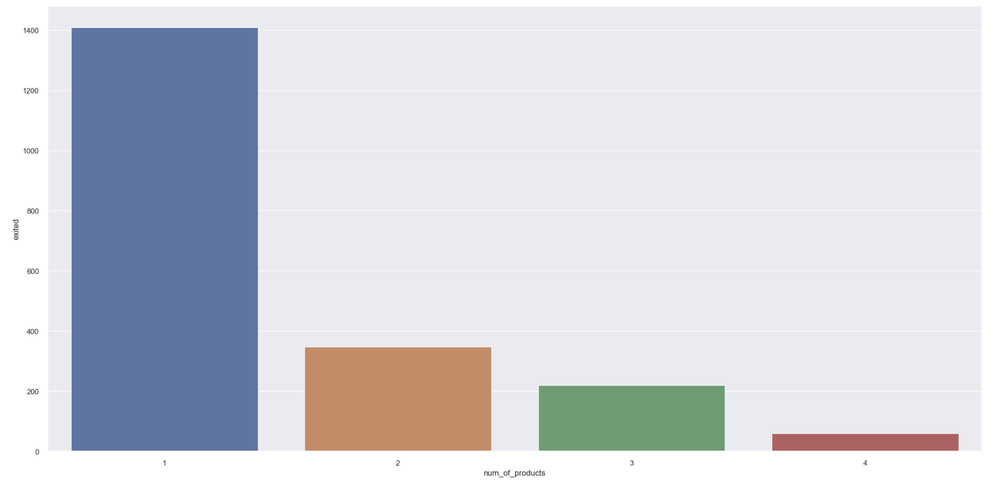

# 5.0 Machine Learning 

## 5.1 Techniques and Performance

To forecast sales, 5 Machine Learning algorithms were used:

- Linear Regression
- Random Forest Classifier
- Extra Trees Classifier
- XGBoost Classifier
- KNN

After testing the selected algorithms, the Cross Validation technique was used to validate the results and ensure the actual performance of each of the models used.

In addition, the Boruta feature selection method was implemented to assist in choosing the most important features, but a drop in performance and quality of the model was noted. Therefore, the method was not used.

After training the models on the training data and having done the Cross-Validation, as well as analyzing the accuracy, f1_score, recall and precision, I chose to use the XGBoost Classifier for presenting incredible performances, close to 90% in the f1_score metric.

Ranking algorithms without Cross Validation:

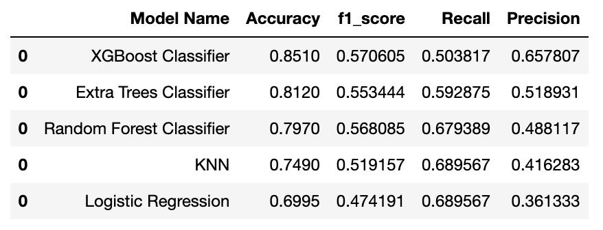

Ranking Algorithms with Cross Validation:

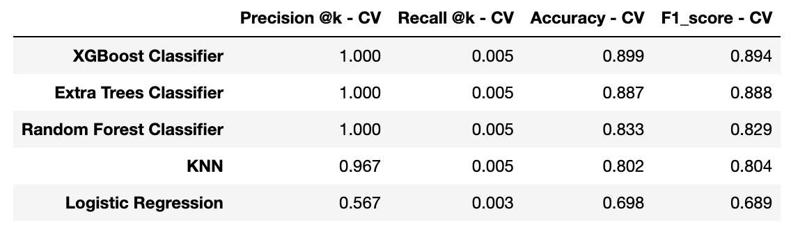

## 5.2 Main Graphs

### 5.2.1 Cumulative Gain Curves

The cumulative gains curve is an evaluation curve that evaluates the performance of the model and compares the results with the random choice ( Baseline ). Shows the percentage of targets hit when considering a certain percentage of the population most likely to be targeted according to the model.

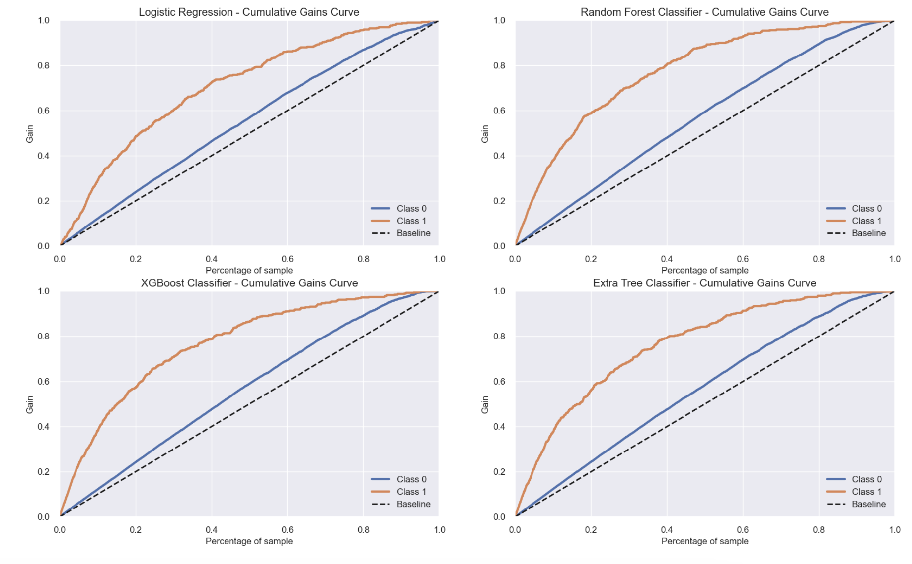

### 5.2.2 Lift Curves

The lift curve graph is derived from the cumulative earnings graph. Values ​​on the y-axis correspond to the ratio of each curve's cumulative gain to the baseline.

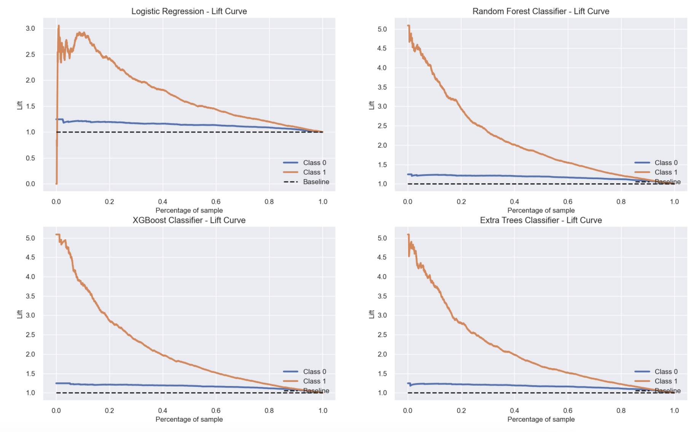

### 5.2.3 ROC AUC Curve

The ROC curve shows how a model performs across all rating thresholds. The area under the curve shows how well the algorithm is able to distinguish between classes.

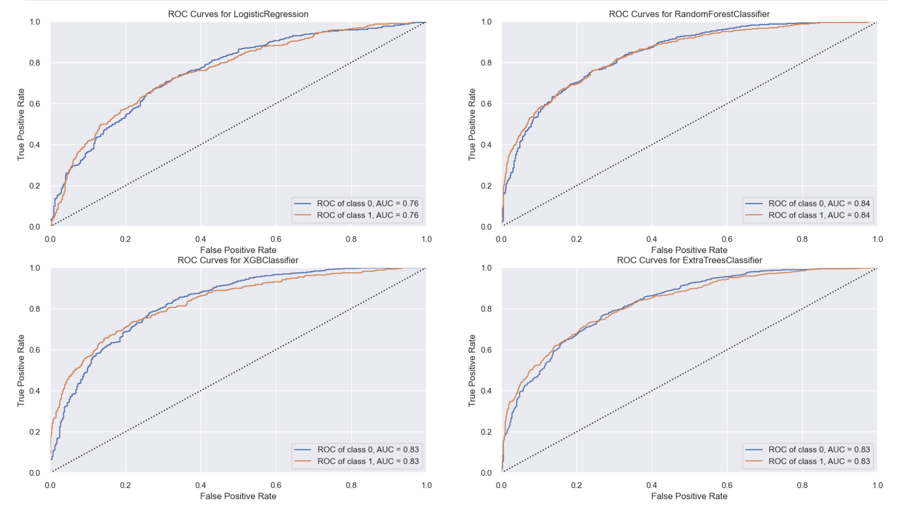

# 6.0 Business Results

A discount of R$ 250.00 was applied to the 3082 customers with the highest probability of churn (> 80%) and we obtained a final profit, as the average of the analyzed scenarios, of R$ 2.785.202,00, which represents an ROI of 361%.

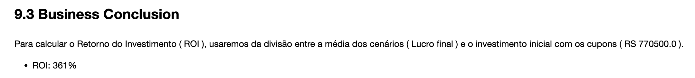

# 7.0 Conclusions

As can be seen, the project solved the initial problem, which was predicting the churn of bank customers, based on a classification model. The model chosen was XGBoost, which achieved excellent metrics (89,4% in the F1 score, for example).

I was also able to formulate an action plan to solve the churning problem based on sending discount coupons to customers with high churn probability and ROI maximization.

In addition, we concluded important insights unknown to the CFO about the business and established financial strategies to not only control the churn rate, but also improve it from the business point of view.

Another important point to highlight is that with the solution created, the CFO can now consult the churn rate via API, therefore, a more agile and easier way for decision making.

In addition, some insights report carried out in [Power BI](https://github.com/luishmq/churn_clients_predict/blob/master/reports/figures/insights.pdf) can be viewed by clicking on the hyperlink.

# 8.0 Lessons Learned

- Prioritize tasks and solutions
- Develop solutions in a cyclical way, thus delivering results in a more agile and efficient way
- Managing unbalanced data with SmoteTomek
- Possibility of agile and professional consultation of predictive data via API

# 9.0 Next Steps

- Respond to new business hypotheses to better understand data and resource relationships and create new hypotheses to verify other resource relationships
- Apply programming techniques to improve the performance of the created solution
- Creation of new functionalities to enrich the data, such as consultation via Google Sheets
