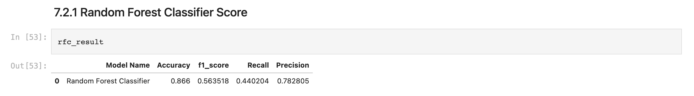
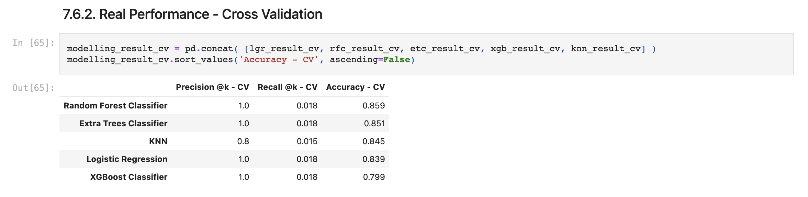
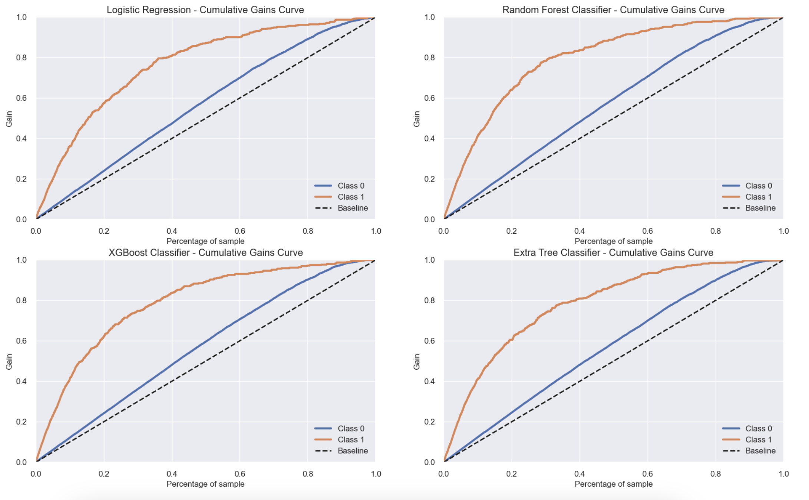

# Previsão - Churn de clientes

Churn de clientes é uma medida do número de contas que deixam de comprar, seja cancelando contrato ou não renovando. Em alguns casos, simplesmente parando de fazer pedidos, o que, de imediato, representa uma perda de receita. Nesse sentido, é uma métrica fundamental para obter respostas estratégicas sobre o negócio, especialmente quando se trata de pensar e agir com vistas a médio e longo prazo. 

Dessa forma, prever essa rotatividade de clientes é extremamente importante para qualquer negócio, pois a maioria das empresas com alto faturamento são aquelas que possuem altas taxas de retenção. Sean Ellis e Morgan Brown indicam em seu livro, Hacking Growth, que com apenas 5% de taxa de retenção, uma empresa pode aumentar de 25% a 95% de seu lucro.

Os dados para análise foram disponibilizados dentro da plataforma de competições de dados [Kaggle](https://www.kaggle.com/datasets/mervetorkan/churndataset).

# 1.0 Problema de Negócio
O CFO de uma empresa bancária possui a necessidade de estudar e entender as possíveis causas da significativa taxa de churn de clientes. Para tanto, ele precisa que alguém desenvolva um modelo de classificação que permita analisar as previsões sobre a taxa especificada.

Nesse sentido, a ideia deste projeto é auxiliar o CFO na tomada de decisão, provendo resultados das previsões de cada cliente do banco, possibilitando que o CFO consulte as previsões por meio do aplicativo Google Sheets.

# 2.0 Premissas de Negócio

Para a construção da solução, foram consideradas as seguintes premissas:

- Desconsiderar os outliers encontrados, haja vista que são importantes para entender a relação entre 2 ou mais variáveis

## 2.1 Descrição dos dados

| Column            | Description                                                                                                                             |
| :---------------- | :-------------------------------------------------------------------------------------------------------------------------------------- |
| `RowNumber`       | Número total de colunas do dataset                                                                                                                                  |
| `CustomerId`      | Identificador único do cliente                                                                                                                           |
| `Surname`         | Último nome do cliente                                                                                                                    |
| `CreditScore`     | Score do cartão do cliente                                                                                                                 |
| `Geography`       | Localidade ( País ) do cliente                                                                                                        |
| `Gender`          | Gênero do cliente                                                                                                                      |
| `Age`             | Idade do cliente                                                                                                                         |
| `Tenure`          | Quantidade de anos que o cliente contrata serviços com o banco                                                                                |
| `Balande`         | Saldo atual do cliente em sua conta no banco                                                                                          |
| `NumOfProducts`   | Quantidade de produtos que o cliente comprou                                                                      |
| `HasCrCard`       | Se o cliente possui ( 1 ) cartão de crédito ou não ( 0 )
| `IsActiveMember`  | Se o cliente é ativo ( Nos últimos 12 meses )                                                     |
| `EstimatedSalary` | Salário anual estimado do cliente                                                                                                         |
| `Exited`          | Se o cliente entrou em churn ( 1 ) ou não ( 0 )

# 3.0 Estratégia da Solução

A estratégia utiliza o método CRISP-DS, que consiste em 9 passos ciclicos, onde a cada iteração dos nove passos, o resultado de negócio vai sendo aperfeiçoado, visando entregas cada vez mais rápidas e cada vez com mais qualidade e acertivas, possibilitando assim que as equipes que irão utilizar os resultados desenvolvidos tenham um produto um produto minimamente utilizável na primeira entrega e que é aperfeiçoado ao longo do tempo.

# 4.0 Insights

## 4.1 Mind Map 

## 4.2 Top 3 Insights

**Hipótese 01: A idade do cliente influencia em possível churn?**

**VERDADEIRA. A idade influencia de forma significativa, haja vista que pessoas mais idosas tendem a realizar o churn ( A partir dos 48/49 anos )**

**Hipótese 02: O score do cliente influencia em possível churn?**

**FALSA. Não há diferença significativa no churn dos clientes com alto ou baixo score do cartão**

**Hipótese 03: O número de produtos comprados pelo cliente influencia em possível churn?**

**VERDADEIRA. O número de produtos influencia em possível churn, haja vista que pessoas com menos produtos tendem a realizar o churn ( Churn rate acima da média )**

# 5.0 Machine Learning 

## 5.1 Técnicas e Performance

Para fazer a previsão de vendas, foram utilizados 5 algoritmos de Machine Learning:

- Linear Regression
- Random Forest Classifier
- Extra Trees Classifier
- XGBoost Classifier
- KNN
Após os testes com os algoritmos selecionados, foi utilizado a técnica de Cross Validation para validar os resultados e garantir a performance real de cada uma dos modelo utilizados.

Além disso, foi implementado o método de seleção de features Boruta para auxiliar na escolha das features mais importantes, porém notou-se uma queda drástica de performance e qualidade do modelo. Assim, o método não foi utilizado.

Após fazer o treinamento dos modelos sobre os dados de treino e ter feito o Cross-Validation, bem como analisar a acurácia, f1_score, recall e precision, optei por usar o Random Forest Classifier.

## 5.2 Principais Gráficos

### 5.2.1 Cumulative Gain Curves

A curva de ganhos cumulativos é uma curva de avaliação que avalia o desempenho do modelo e compara os resultados com a escolha aleatória ( Baseline ). Mostra a porcentagem de alvos atingidos ao considerar um determinado percentual da população com maior probabilidade de ser alvo de acordo com o modelo.

### 5.2.2 Lift Curves

# 6.0 Resultados Financeiros

# 7.0 Conclusões

Conforme pôde ser verificado, o projeto resolveu o problema inicial, que era a previsão do churn de clientes do banco.

Ademais, concluimos importantes insights desconhecidos pelo CFO sobre o negócio e estabelecemos estratégias financeiras para não somente controlar a taxa de churn, como também melhorá-la no ponto de vista do negócio.

Outro ponto importante de destacar é que com a solução criada, o CFO pode agora consultar a taxa de churn utilizando o aplicativo Google Sheets, uma maneira, portanto, mais ágil e fácil para a tomada de decisão.

# 8.0 Lições Aprendidas

- Priorizar tarefas e soluções
- Desenvolver soluções de forma cíclica, entregando assim resultados de forma mais ágil e eficiente
- Possibilidade de consulta ágil e profissional dos dados preditivos no aplicativo Google Sheets

# 9.0 Próximos Passos

- Responder a novas hipóteses de negócios para entender melhor os dados e as relações de recursos e criar novas hipóteses para verificar outras relações de recursos.
- Aplicar técnicas de programação para melhorar o desempenho da solução criada.
- Criação de novas funcionalidades para enriquecer os dados.
